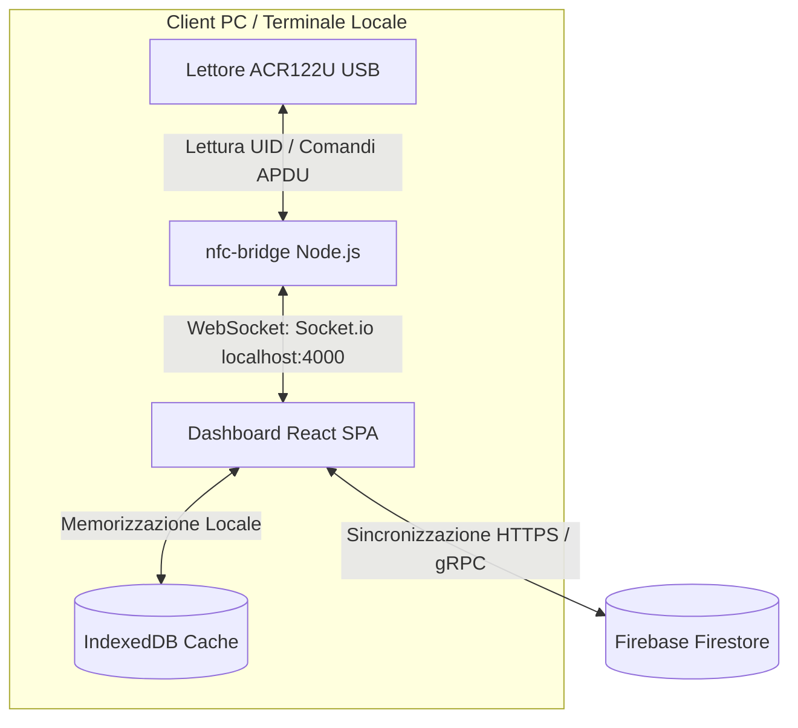

# Specifiche Tecniche - Sistema Check-In/Out NFC Grest

Questo documento descrive in dettaglio l'architettura tecnica, le scelte tecnologiche, lo schema del database e i protocolli di comunicazione utilizzati nel sistema di rilevazione presenze.

---

## 🏗️ Architettura Generale

Il sistema adotta un'architettura **Offline-First** a due componenti principali più un database centralizzato in cloud:



---

## 🗄️ Database e Persistenza

Il database principale è ospitato su **Google Firebase Firestore**, ma l'applicazione è strutturata per funzionare in modalità **Offline-First** grazie alla persistenza locale.

### Sincronizzazione Offline-First
*   **Tecnologia**: `IndexedDB` gestito tramite l'SDK di Firebase (`persistentLocalCache`).
*   **Comportamento**: Tutte le letture, associazioni e timbrature vengono registrate immediatamente nel database locale del browser. In caso di assenza di rete, l'applicazione continua a funzionare regolarmente. Non appena la connessione internet viene ripristinata, le modifiche locali vengono sincronizzate automaticamente con Firestore in background.

### Schema delle Collezioni (Firestore)

#### 1. Collezione `utenti`
Memorizza l'anagrafica del personale scollegando i dati sensibili.

| Campo | Tipo | Descrizione |
| :--- | :--- | :--- |
| `id` | String | Identificativo univoco (generato automaticamente da Firestore) |
| `nome` | String | Nome dell'utente |
| `cognome` | String | Cognome dell'utente |
| `ruolo` | String | Ruolo lavorativo: `"Responsabile" \| "Animatore" \| "Aiuto-Animatore"` |
| `nfc_uid` | String (null) | Identificativo esadecimale del braccialetto NFC (es: `04:a1:b2:c3:d4:e5:f6`). Deve essere unico. |
| `stato` | String | Stato utente: `"attivo" \| "archiviato"` (Soft Delete per conservare lo storico) |

#### 2. Collezione `timbrature`
Registra i passaggi di entrata e uscita.

| Campo | Tipo | Descrizione |
| :--- | :--- | :--- |
| `id` | String | Identificativo univoco |
| `utente_id` | String | Riferimento al documento dell'utente nella collezione `utenti` |
| `timestamp` | Timestamp | Data e ora della timbratura (utilizza `serverTimestamp()` in scrittura) |
| `tipo` | String | Direzione del passaggio: `"ENTRATA" \| "USCITA"` |
| `metodo` | String | Modalità di inserimento: `"NFC" \| "MANUALE"` |

---

## 🔌 API e Protocollo di Comunicazione (WebSocket)

La comunicazione tra il bridge hardware locale (`nfc-bridge`) e l'interfaccia utente (`dashboard`) avviene via **WebSocket** sulla porta **4000** tramite la libreria `socket.io`.

### Eventi WebSocket

#### Da `nfc-bridge` a `dashboard` (Server -> Client)
1.  **`reader_status`**: Notifica lo stato attuale del lettore hardware.
    *   *Payload*: `{ connected: boolean, name: string | null }`
2.  **`nfc_read`**: Inviato quando una tessera/braccialetto viene appoggiato sul lettore.
    *   *Payload*: `{ uid: string }` (dove `uid` è l'identificativo esadecimale letto dal tag)

#### Da `dashboard` a `nfc-bridge` (Client -> Server)
1.  **`beep`**: Richiede al bridge di far emettere un segnale acustico al lettore hardware.
    *   *Payload*: `{ type: "success" | "error" }`
    *   *Dettaglio APDU*:
        *   Per `success` (1 bip): Invia l'APDU `FF 00 40 00 04 02 01 01 01`
        *   Per `error` (3 bip veloci): Invia l'APDU `FF 00 40 00 04 02 01 01 03`

---

## 🛠️ Stack Hardware e Driver NFC

*   **Lettore NFC supportato**: ACR122U USB (lettore di smart card e tag contactless a 13.56 MHz).
*   **Driver**: Richiede i driver di sistema compatibili con lo standard PC/SC (Personal Computer/Smart Card).
*   **Moduli Node.js**:
    *   `nfc-pcsc`: Interfaccia nativa basata su C++ che si collega al demone PC/SC del sistema operativo.
    *   `pcsclite` (sotto Windows e Linux) per la gestione a basso livello.
*   **Tag compatibili**: Standard ISO/IEC 14443 Type A & B, MIFARE, FeliCa e in particolare tag NFC **NTAG213** comunemente usati nei braccialetti in silicone.

### Modalità Simulatore (Mock)
In assenza di hardware reale, il bridge può funzionare in modalità simulatore via terminale. Questa modalità emula l'evento `nfc_read` leggendo l'input da tastiera (CLI standard input) e inviando l'UID digitato alla dashboard.

---

## 🔒 Sicurezza e Regole Firestore (Security Rules)

Per garantire la protezione dei dati, le regole di sicurezza di Firestore devono essere impostate per consentire l'accesso controllato. Di seguito il modello consigliato da deployare nella Firebase Console:

```javascript
rules_version = '2';
service cloud.firestore {
  match /databases/{database}/documents {
    // Regole per la collezione utenti
    match /utenti/{utenteId} {
      allow read, write: if true; // Inserire eventuali vincoli di autenticazione qui se configurati
    }
    
    // Regole per la collezione timbrature
    match /timbrature/{timbraturaId} {
      allow read, write: if true;
    }
  }
}
```
*(Nota: Nello scenario offline in rete locale con PC dedicato, le regole possono essere configurate per permettere la scrittura libera da client fidati, ma in ambienti di produzione è fortemente consigliato abilitare Firebase Auth ed associare `request.auth != null`)*.
